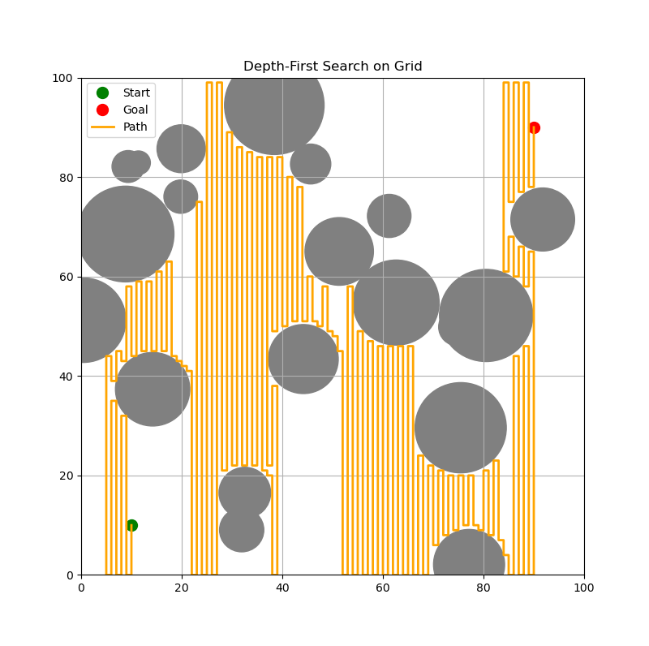
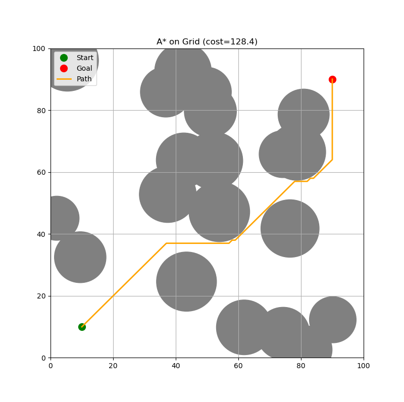
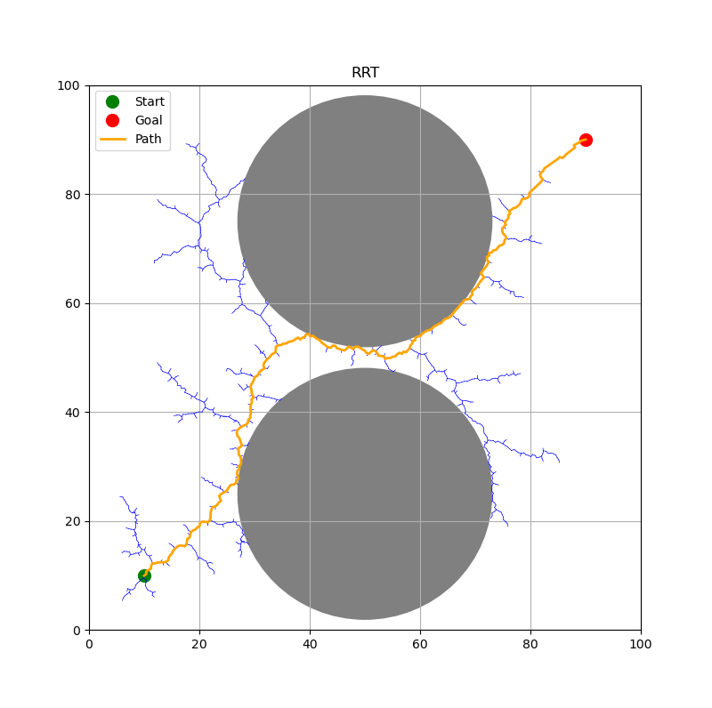
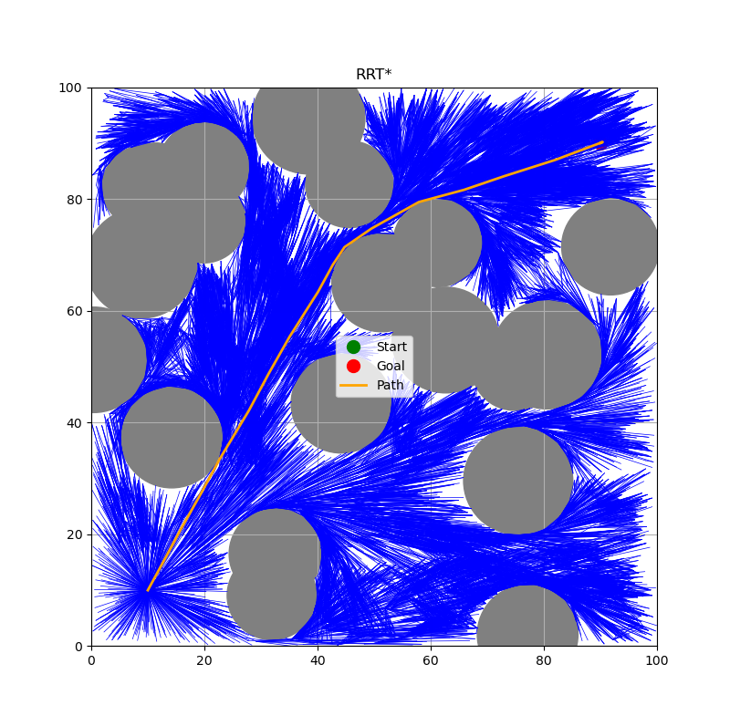

# Motion Planning Algorithms

Implementing fundamental motion-planning algorithms in Python.

---

## Contents

- **Graph Search**  
  - Depth-First Search (DFS)
    
  - Breadth-First Search (BFS)  
  - Dijkstra’s Algorithm
    
  - A* Search
    

- **Sampling-Based**  
  - Rapidly-exploring Random Tree (RRT)
    
  - RRT* (Optimal RRT)
    
---
