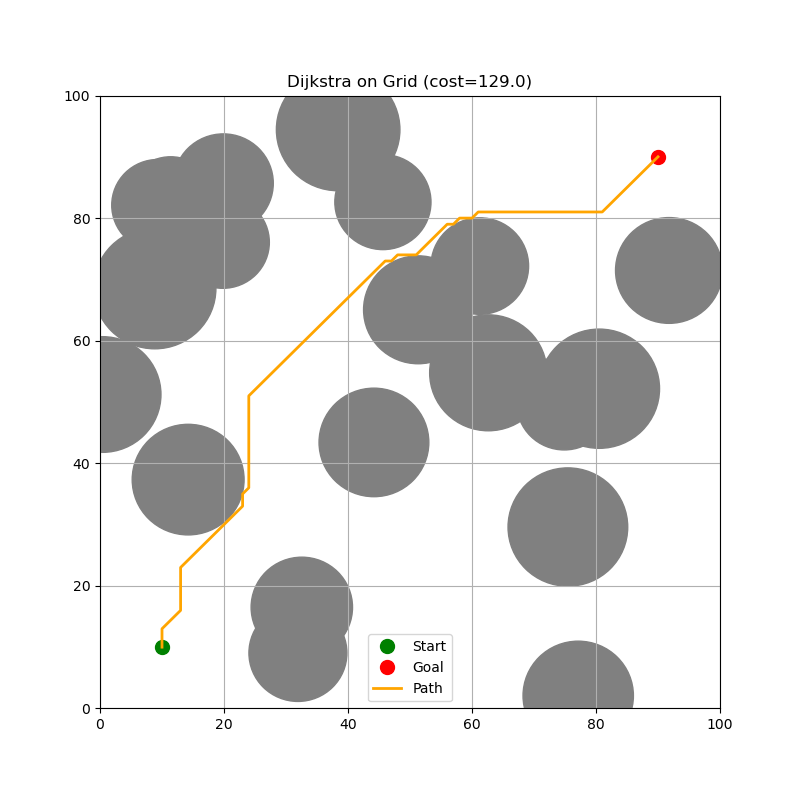

# Motion-Planning-Algorithms 🚗🤖

A repository containing **clean, educational implementations** of classic motion planning algorithms in Python, with visualization examples. Ideal for learning, teaching, or bootstrapping robotics and simulation projects.

---

## ✨ Key Algorithms
| Algorithm         | Description                                                                    |
|-------------------|--------------------------------------------------------------------------------|
| Depth-First Search (DFS) | Grid-based depth-first search for path planning.
| A\*               | Grid-based, heuristic search for optimal path planning.                       |
| Dijkstra          | Uniform-cost search for shortest paths in weighted graphs.                    |
| Rapidly-Exploring Random Tree (RRT)    | Sampling-based planner for high-dimensional spaces.        |
| RRT\*             | Asymptotically optimal variant of RRT.                                        |
| Probabilistic Roadmap (PRM)            | Global roadmap-based approach for multi-query planning. |

---

## 📦 Installation
```bash
# Clone the repo
git clone https://github.com/AayushmanSharma96/Motion-Planning-Algorithms.git
cd Motion-Planning-Algorithms

# (Optional) create a virtual environment
python3 -m venv venv
source venv/bin/activate

# Install dependencies
pip install numpy matplotlib
```

---

## 🚀 Usage

Each algorithm script can be run directly. For example:

```bash
# Run A* on a sample grid map
python a_star.py

# Run RRT* in a 2D environment
python rrt_star.py
```


---

## 📈 Visualization

- **Graph Search**  
<p align="center">
  
</p>

<p align="center">
  
</p>

<p align="center">
  
</p>

- **Sampling-Based**  
<p align="center">
  
</p>
<p align="center">
  
</p>

---


